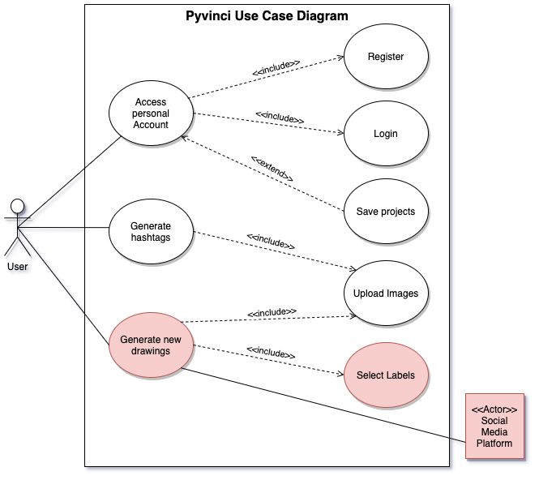
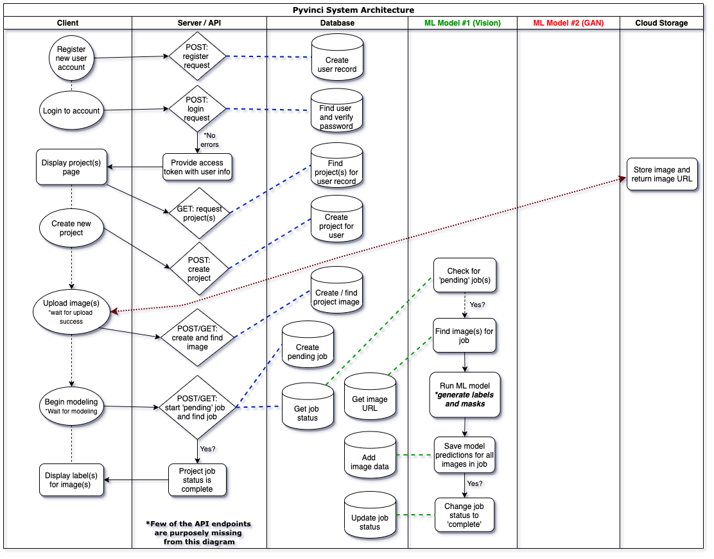

# Pytorch Summer Hackathon 2020 Information Page

## Project name: PyVinci

### Team Members:
- Santiago Norena
- Hector Mejia
- Nicolas David
- Alejandro Martinez
- Sahivi Gonzalez
---------------------------------------------------------------------------------------
## Project Architecture:

#### Main Use Cases
- Use Case #1: Hashtag generator (Using a panoptic segmentation model)
- Use Case #2 (Unreleased in production): Generate new image from user labels (Using layer based sequencing image generator with GANs with the labels/masks created by the panoptic segmentation model)

#### Use Case Diagram (VERSION 2 *NOTE: areas highlighted in red were not released in production)

#### Cross-Function / Swim Lane Diagram (VERSION 2 *NOTE: final production version released for competition)

### PyVinci Initial Concept:

## Project Deployment:

#### Webpage
- https://www.pyvinci.com/ (*NOTE: no longer in production)

### Deploment Demo
- TODO: Show screenshots
- Add link to video

### Main Technologies:
- Python
- PyTorch
- Detectron2
- PostgreSQL
- Docker
- SQLAlchemy
- Go
- React

### Acknowledgements:
- TODO
