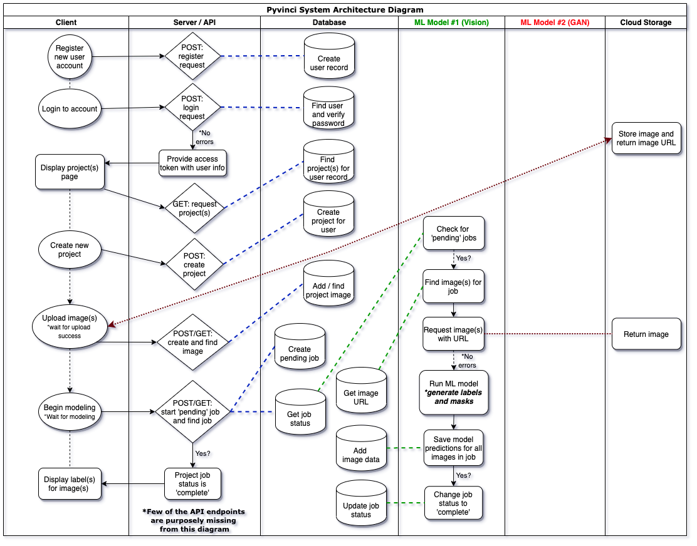
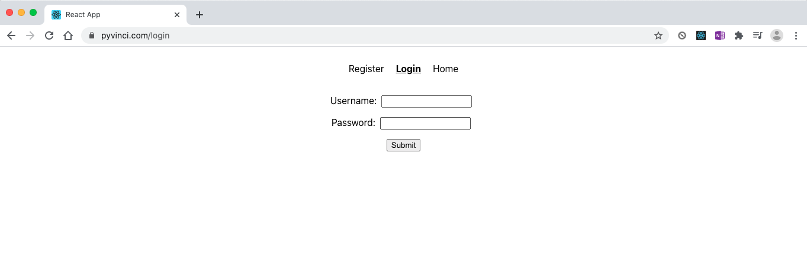
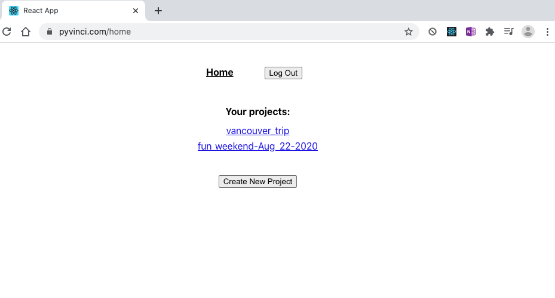
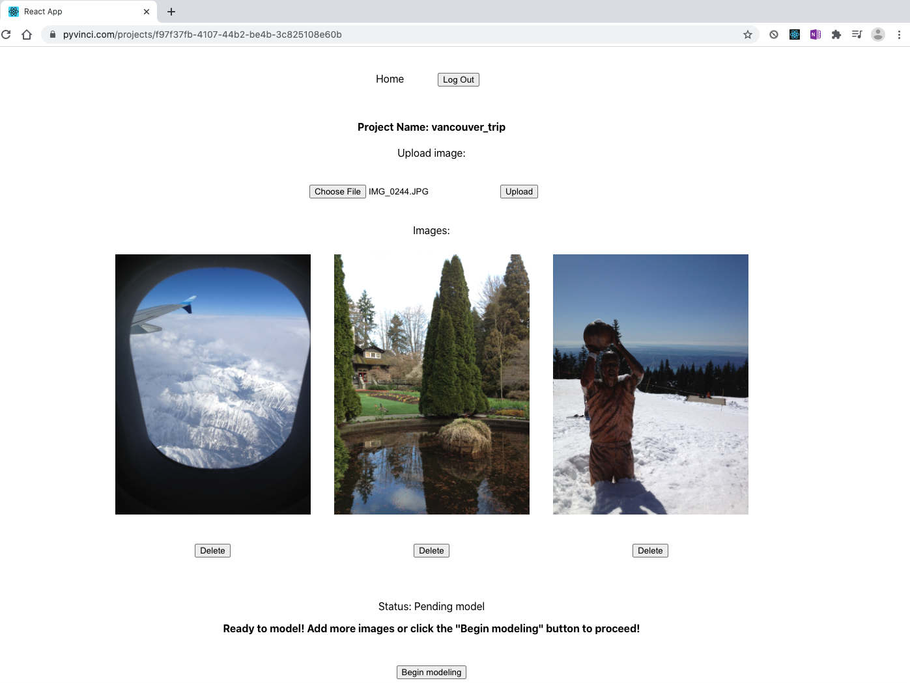
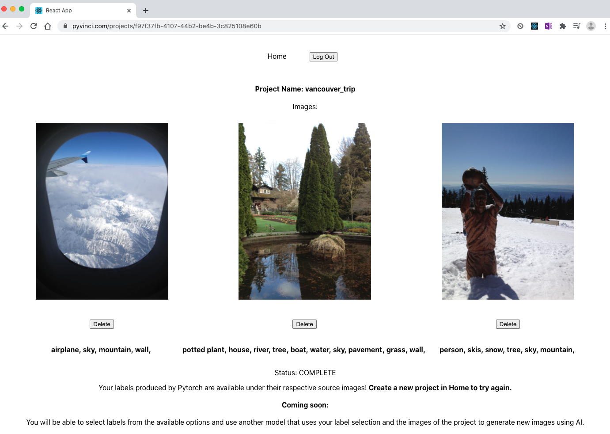

# Pytorch Summer Hackathon 2020 Information Page

## Project name: PyVinci

#### Main packages deployed:
- pyvinci-segmentation 
- pyvinci-client
- pyvinci-server

#### Main use cases:
- 1: Hashtag generator (Using a panoptic segmentation model)
- 2: (Not released): Generate new image from user labels (Using layer based sequencing image generator with GANs with the labels/masks created by the panoptic segmentation model)

#### Team members:
- Santiago Norena
- Hector Mejia
- Nicolas David
- Alejandro Martinez
- Sahivi Gonzalez

---------------------------------------------------------------------------------------
## PyVinci Use Case Diagram 
###### VERSION 2 (Areas highlighted in red were not released into production)

## PyVinci System Architecture Diagram 
##### Cross-function / Swimlane diagram
###### VERSION 2 (Version released for competition)

---------------------------------------------------------------------------------------
## Deployment Demo:

Accessing the domain name https://www.pyvinci.com/ will take user to the main page. (No longer in production)

#### New user needs to register, then login.

#### Once logged in, user can see list of projects, or create a new one.

#### After uploading images in new project page, the user can click "Begin Modeling".

#### After the ML model generates labels for all images, they will show up below each image. 
#### User can click "Home" to create a new project or see list of projects.

## PyVinci Initial Concept

## PyVinci Initial Concept

## It was built with:
- numpy
- python
- pytorch
- detectron2
- cv2
- psycopq2
- sqlalchemy
- posgresql
- docker
- go / golang 
- go-fiber
- nginx
- Amazon Web Services (AWS): EC2, S3
- npm
- react
- miragejs

### Acknowledgements:
- https://github.com/0zgur0/Seq_Scene_Gen
