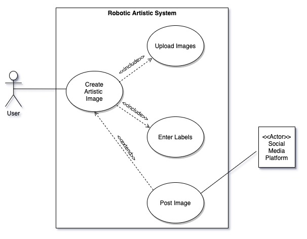

# General Pytorch Summer Hackathon 2020 Information Page

## Project name: PyVinci
---------------------------------------------------------------------------------------
### Project Use Cases
- Use Case #1: Hashtag generator
- Use Case #2: Generate new image from user selected labels

### Project Repos:
- https://github.com/NicolasADavid/pyvinci-client
- https://github.com/Alejom334/pyvinci-segmentation
- https://github.com/caquillo07/pyvinci-server

### Project Architecture

#### Use Case Diagram (VERSION 1)

#### Cross-Function / Swim Lane Diagram (VERSION 1)

#### PyVinci Concept (Use Case #2)

